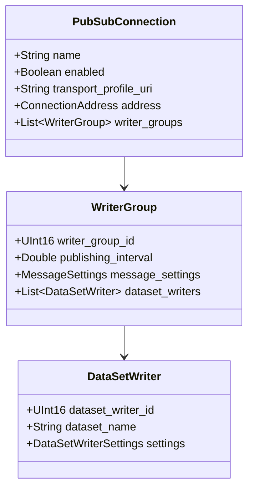
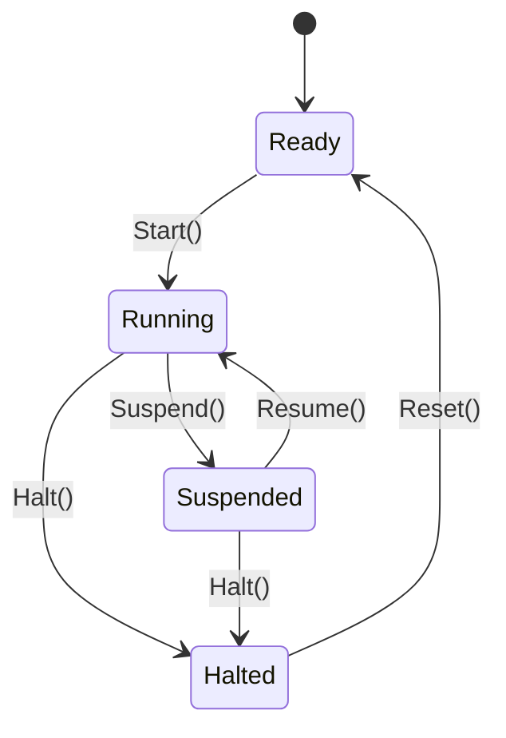

# Data Model: Complete OPC UA Compliance

This document details the data structures, database schema, and state transitions for the complete OPC UA compliance implementation.

## 1. PubSub Configuration Data Model

The OPC UA PubSub (Part 14) configuration model is structured hierarchically.



### Struct Layouts (`async-opcua-pubsub`)

```rust
pub struct PubSubConnection {
    pub name: String,
    pub enabled: bool,
    pub transport_profile_uri: String,
    pub address: TransportAddress,
    pub writer_groups: Vec<WriterGroup>,
}

pub struct WriterGroup {
    pub writer_group_id: u16,
    pub publishing_interval: f64, // milliseconds
    pub message_settings: MessageSettings,
    pub dataset_writers: Vec<DataSetWriter>,
}

pub struct DataSetWriter {
    pub dataset_writer_id: u16,
    pub dataset_name: String,
    pub key_frame_count: u32,
}

pub enum TransportAddress {
    Mqtt { broker_url: String, topic_prefix: String },
    Amqp { broker_url: String, queue_name: String },
    WebSocket { url: String },
    UdpMulticast { ip: String, port: u16 },
}
```

---

## 2. Historical Data Access (HDA) Database Schema

For local persistent HDA support, a SQLite database schema is defined in the `async-opcua-history-sqlite` crate.

### SQLite Schema

```sql
-- Table storing historical telemetry data values for monitored nodes
CREATE TABLE IF NOT EXISTS historical_values (
    node_id TEXT NOT NULL,
    server_timestamp INTEGER NOT NULL, -- Unix microseconds
    source_timestamp INTEGER,          -- Unix microseconds
    value_variant BLOB NOT NULL,       -- Serialized Binary representation of Variant
    status_code INTEGER NOT NULL,      -- 32-bit OPC UA StatusCode
    PRIMARY KEY (node_id, server_timestamp)
);

CREATE INDEX IF NOT EXISTS idx_historical_values_query 
ON historical_values (node_id, server_timestamp ASC);
```

---

## 3. Global Discovery Server (GDS) Enrollment & Trust List

### Struct Layouts

```rust
pub struct GdsEnrollment {
    pub gds_endpoint_url: String,
    pub application_uri: String,
    pub registration_state: RegistrationState,
    pub cached_credentials: Option<CachedCredentials>,
}

pub enum RegistrationState {
    Unregistered,
    Registered,
    RenewalPending { request_id: String },
    Failed { reason: String },
}

pub struct CachedCredentials {
    pub certificate_der: Vec<u8>,
    pub private_key_der: Vec<u8>,
    pub trust_list_der: Vec<u8>,
}
```

---

## 4. Program State Machine State Definitions

OPC UA Part 10 defines a state machine representing long-running execution states.



### State Machine Representation
- **ReadyState**: Waiting for the Start invocation.
- **RunningState**: Task is actively processing on background event loops.
- **SuspendedState**: Execution task is paused, retaining its internal context.
- **HaltedState**: Execution terminated, resources are retained for debugging/inspection until Reset.

---

## 5. Stateful Session & Temporary File Configuration

To prevent denial-of-service (DoS) memory/disk exhaustion:

```rust
pub struct FileTransferConfig {
    pub base_temp_dir: std::path::PathBuf,
    pub max_file_size_bytes: u64,
    pub max_concurrent_transfers: usize,
}

pub struct ActiveFileTransfer {
    pub file_handle: u32,
    pub temp_file_path: std::path::PathBuf,
    pub bytes_written: u64,
    pub owner_session_id: NodeId,
}
```
