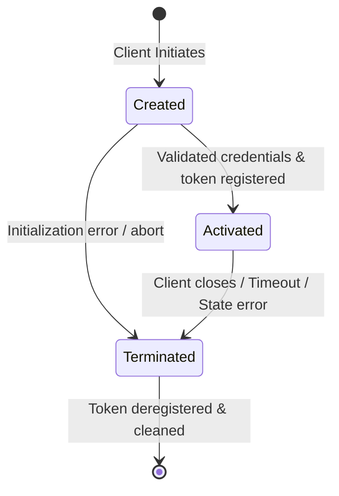
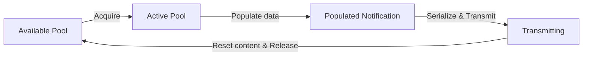

# Data Model Design: Future Performance Optimizations

This document defines the key entities, relationships, validation rules, and lifecycle transitions for the optimized components.

---

## 1. Entity: Session Registry

A registry that maps active authentication tokens to their corresponding session execution contexts.

### Attributes
*   **Authentication Token**: Uniquely identifies a client session.
*   **Session Context Reference**: A handle/channel to send operations to the active session handler.

### Relationships
*   **One-to-Many**: The Registry maps each unique authentication token to exactly one Session Context.

---

## 2. Entity: Session Actor & State

An isolated execution context managing the state and lifecycle of a client session.

### Attributes
*   **Session Identifier**: Unique ID of the session.
*   **Client Security Profile**: The negotiated security level.
*   **Subscription Directory**: List of active subscriptions on this session.
*   **State**: The current phase of the session lifecycle (e.g., Created, Activated, Closed).

### State Transitions

---

## 3. Entity: Reusable Write Buffer

A connection-local memory region reused sequentially to prepare and transmit outbound network frames.

### Attributes
*   **Buffer Capacity**: The maximum allocated byte capacity.
*   **Write Pointer**: Represents the current serialization offset.

### Validations
*   **Boundary Validation**: If a serialized frame exceeds the current Buffer Capacity, the buffer MUST resize or split the data into negotiated frame sizes.

---

## 4. Entity: Notification Pool

A collection of pre-allocated, recycled notification structures used to dispatch subscription value updates.

### Attributes
*   **Capacity Limit**: The hard maximum number of notification structures pre-allocated in the pool.
*   **Available Pool**: The collection of inactive notification objects ready for reuse.
*   **Active Pool**: The collection of notifications currently traversing the serialization pipeline.

### Lifecycle of a Notification Object

